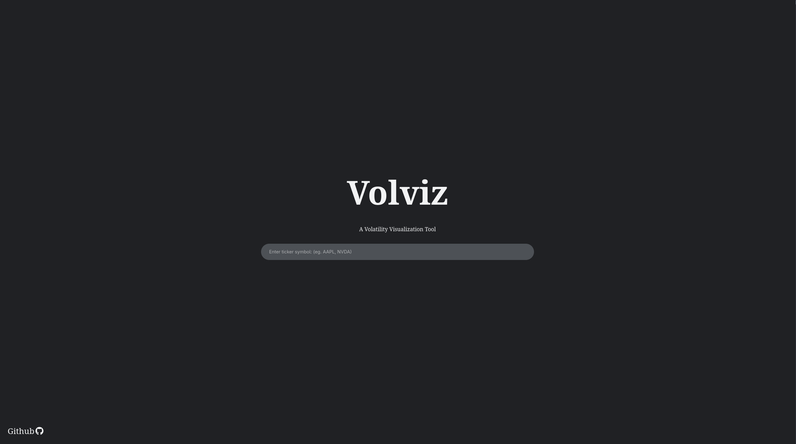
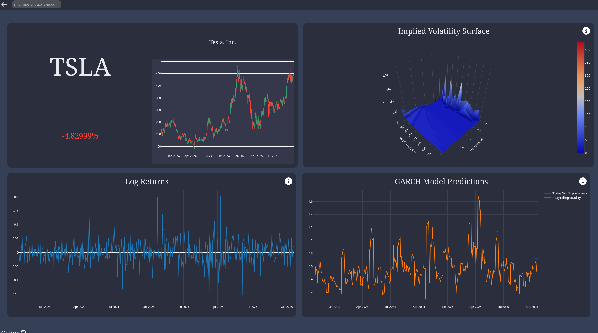
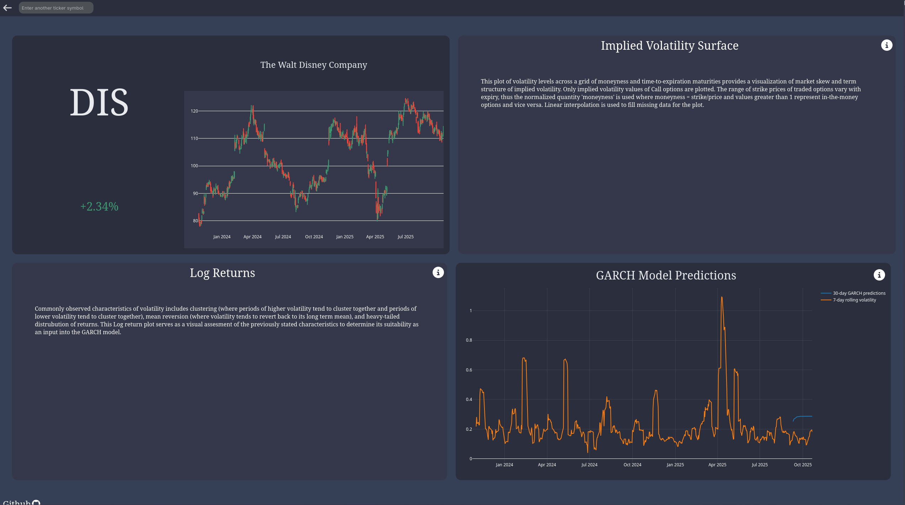

# Volviz

Hosted on <a href="https://render.com/">Render</a> at <a href="https://volviz.onrender.com">https://volviz.onrender.com</a>, Volviz is a simple web application that provides a dashboard view of volatility visualizations of any given stock ticker. 

## Features

* Built with Plotly.js for dynamic and responsive charts.
* GARCH Modeling: Implements a GARCH(1,1) model to forecast volatility using a Python backend.
* User-Friendly Interface: Simple input field for stock tickers with instant plot updates.

## Tech Stack 

* Frontend: HTML, CSS, JavaScript, Plotly.js
* Backend: Python (Flask), pandas, NumPy, arch (for GARCH modeling)
* Deployment: Render

</i>
</i>
</i>
